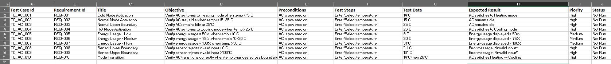

# ISTQB Foundation Sample Test Suite – Smart Air Conditioning System

## About This Test Suite
This repository contains a structured test suite for a smart air conditioning system (similar to Samsung, LG, or Daikin).  
It demonstrates ISTQB Foundation techniques such as **Boundary Value Analysis (BVA)** and **Equivalence Partitioning (EP)** applied to numeric ranges.

The focus is on ensuring that:
- The AC switches modes correctly (Heating, Idle, Cooling) based on temperature thresholds.
- Energy usage percentages are calculated accurately.
- Sensor input validation rejects values outside 0–100°C.
- Mode transitions occur correctly when temperature changes across boundaries.

---

## Files
- **SmartAC-TestSuite.xlsx** → Includes a professional cover page and formatted test suite.  
- **SmartAC-TestSuite.csv** → Lightweight version for quick preview and tool import.  

---

## Test Case Categories
- **Mode Switching** → Cold, Normal, Hot thresholds.  
- **Energy Usage** → Low, Medium, High percentages.  
- **Sensor Validation** → Input range 0–100°C.  
- **Boundary Transitions** → Switching between modes.  

---

## Notes
- Status values are set to *Not Run* as this is a sample design portfolio.  
- In a real project, statuses would be updated during execution in tools like **TestRail** or **Jira Zephyr**.  
- Both `.xlsx` and `.csv` formats are provided:  
  - Excel shows professional formatting and cover page.  
  - CSV allows quick preview and import into test management tools.  

---

